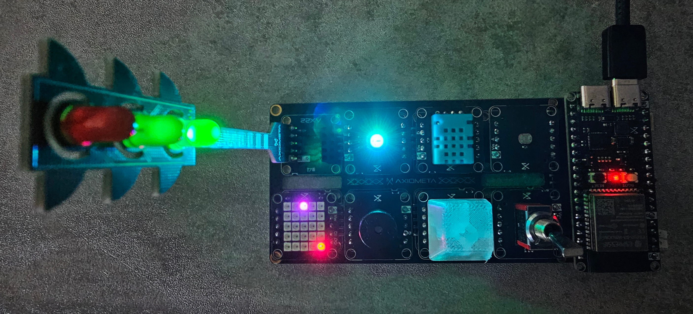
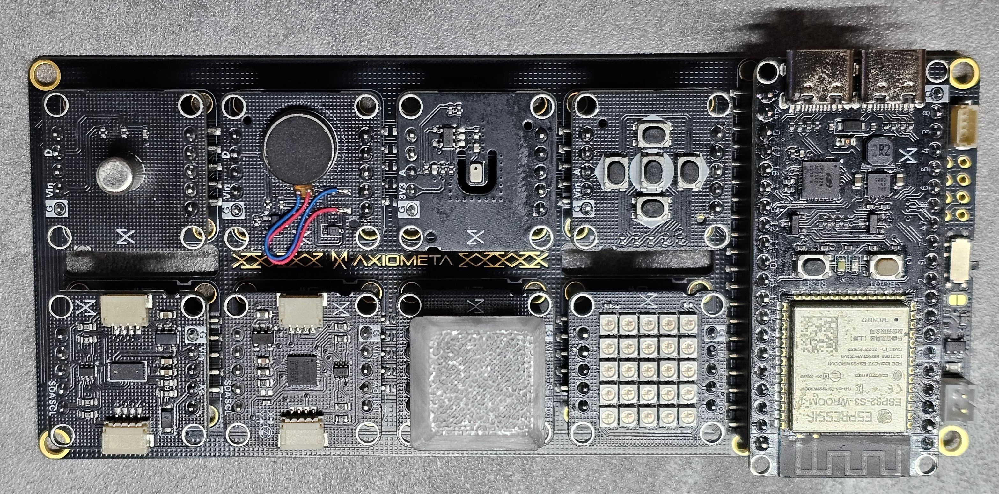

# Axiometa genesis

Collected findings from experiments with axiometa genesis board.

**Environment**: PC Win11, Powershell, Visual Studio Code<br>
**Controller**: ESP32-S3<br>
**Main board, module**s: [Axiometa genesis](https://axiometa.ai/genesis/)<br>
**Programming**: Toit jaguar<br>


## 1. setup controller with Toit jaguar
- Connect USB from ESP32-S3 OTG to PC
- press BOOT button
- flash **jaguar**: `jag flash -cesp32s3 -p COM8 --name GENESIS`
- check flashing: `jag scan GENESIS`
```
    Scanning for device with name: 'GENESIS'
    address: http://192.168.178.56:9000
    chip: esp32s3
    id: 00014523-f5c9-4595-86a9-930cbe63b6ca
    name: GENESIS
    proxied: false
    sdkVersion: v2.0.0-alpha.184
    wordSize: 4
```
- toit app [**test-esp**](/src/test-esp.toit)
- run **example**: `jag run .\test-esp.toit`
  - onboard led **blinks slowly**
  - if boot button is pressed then the led **blinks faster**
- monitor output: `jag monitor -a -p COM8`

## 2. checking AX22 modules

The **main board** has places for 8 AX22 modules. <br>*It carries useful information:* The **GPIO port numbers** are printed on the module positions.


The genesis eletronics kit contains more than 20 **AX22 modules**.<br>
Attention when occupying **module space #1**: **Port 2** is identical to ESP **boot button**.


### first AX22-module configuration 


    1. ✅ LDR -0005
    2. ✅ DHT11 -0011
    3. ✅ RGB-Led -0006 *3x LED (RGB)*
    4. ✅ TrafficLight -0024 *3x LED (RYG)*
    5. ✅ NeoPixelMatrix -0028 *15x RGB*
    6. ✅ Buzzer -0012 
    7. ✅ KeyboardKey -0027 *1x RGB*
    8. ✅ ToggleSwitch -0022


- toit app [**test-config1.toit**](/src/test-config1.toit) tests the modules and prints out results on monitor.
  - run monitor: `jag monitor -p COMx`
  - run toit app: `jag run .\test-config1.toit`

### Second AX22-module configuration 


    1. ✅ D-Pad 0016
    2. ❌ MicroPhone 0009 ? (total insensitive)
    4. ✅ Vibration Switch 0025
    5. ToF 0015 VL53L0CX
    6. Accelerometer 0030 MPU6050
    7. ✅ KeyboardKey 0027  1x RGB
    8. ✅ NeoPixelMatrix 0028 15x RGB

- toit app [**test-config2.toit**](/src/test-config2.toit) tests the modules and prints out results on monitor.
  - run monitor: `jag monitor -p COMx`
  - run toit app: `jag run .\test-config2.toit`


#### BLE remote camera
While playing around with the AX22 modules, I came across the VL53L0CX and immediately thought about implementing a smartphone camera shutter. When searching for BLE information, I was overwhelmed by the complexity. Since I had no experience with BLE and wanted quick results, I ordered a small BLE hardware switch **BT1818** for my initial experiments.  
It took a while, however, before our own experiments bore fruit. Information and tools from **nRF**, and of course, a particularly clever artificial Frenchman named **Claude**, were particularly helpful.  
The first implementation in Toit **test-camera** uses only the AX22 keypad module and triggers it at the push of a button.  
Start scan on smartphone (it has to support BLE!) and pair **BLE Camera**. If successful, **volume up** is sent when the button is pressed, which triggers a photo capture in many camera apps.  
  
The basis for sensor-controlled smartphone recordings is in place and now the various modules of the **Axiometa genesis board** can be used according to your own inspiration.